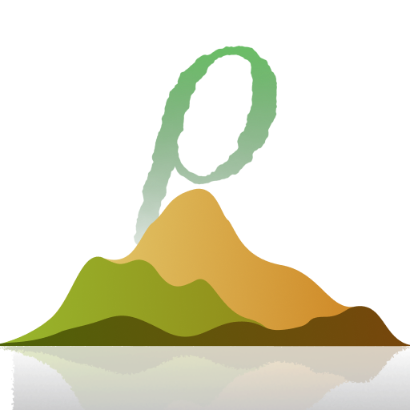

<h1 align="center"> Rhombus </h1>

A Python embedded Domain Specific Language for Minecraft Terrain Generation

<code>pip install rhombus</code>

### Abstract

Rhombus is a Python sub-language delivered as a package that can be used to create expressions resembling the abstract syntax trees of density functions for Minecraft. 
It allows you to comfortably write density functions while benefiting from Python's forgiving syntax.

###### This project is pretty similar to [misode/gaia-beet](https://github.com/misode/gaia-beet), which you might also find useful. But know that I started developing Rhombus before I knew about it. The similarities in concept are quite frightening though. The biggest difference to Misode's gaia-beet is that I'm not primarily developing a beet plugin — although integration is possible and recommended — but rather view Rhombus as a coherent, albeit simple, language and am trying to further develop and improve it in this sense.

## Key Advantages
- 📦 **Object-oriented Design** 
Full use of Python’s object model for composing, reusing, and structuring density expressions.
- 📝 **Native Comments** 
Density logic is written in Python, so comments work naturally without any custom syntax.
- 📖 **Integrated Documentation** 
Functions and classes provide detailed docstrings describing behavior, parameters, and usage.
- ⚡ **Efficient Worldgen Performance** 
Density expressions are transpiled into as few files as possible, reducing overhead during chunk generation.
- ⚙️ **High Compatability** 
As long as the density function definiton format remains unchanged in new version, generated data works across all Minecraft versions. Supporting additional features from mods is straightforward.

## Features
- **Unified Density Type**: 
Represents any computed density value, independent of its underlying implementation.
- **Intuitive AST Construction**:
Density function trees can be built using arithmetic operators, provided interfaces, or custom methods.
- **Complete Vanilla Coverage**:
High-level Python interfaces for all vanilla density function types.
- **Advanced Macros**:
Shortcuts for more complex, commonly needed processes.

## What Rombus is not and what we cannot guarantee it will become
- **A Visualizer Tool**:
Currently, all exising density function visualizing tools are based on JavaScript, making it difficult to embed in Rhombus. But by working with Rhombus in combination with [beet watch](https://mcbeet.dev/getting_started/#building-the-pack) and Misode's [Worldgen Tools Extension](https://marketplace.visualstudio.com/items?itemName=Misodee.worldgen-tools) you can get quite efficient anyway.